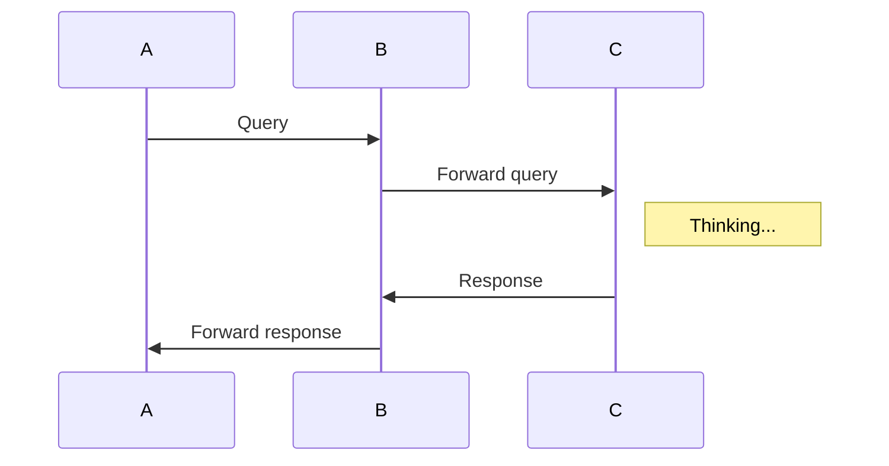
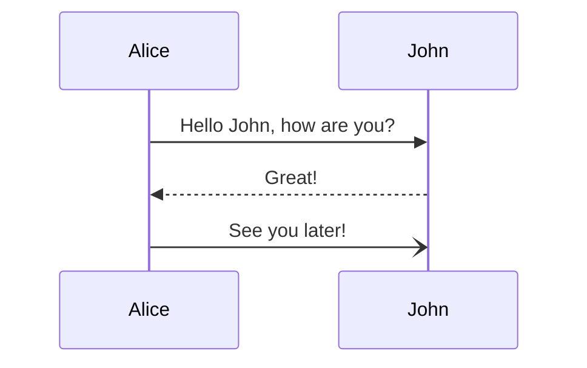

# test-mermaid

```mermaid
sequenceDiagram
  A->> B: Query
  B->> C: Forward query
  Note right of C: Thinking...
  C->> B: Response
  B->> A: Forward response
```

```mermaid
sequenceDiagram
    Alice->>John: Hello John, how are you?
    John-->>Alice: Great!
    Alice-)John: See you later!
```

```mermaid
graph TD;
    A-->B;
    A-->C;
    B-->D;
    C-->D;
```
